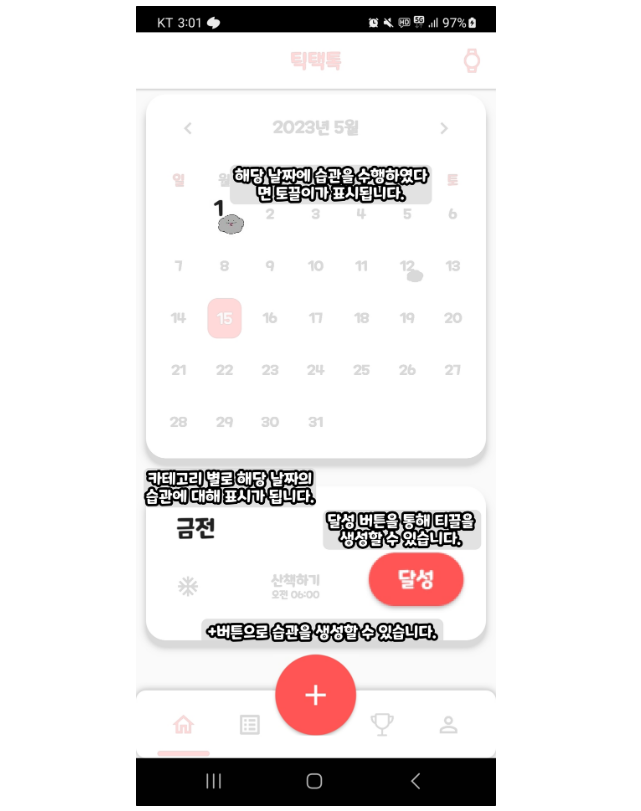
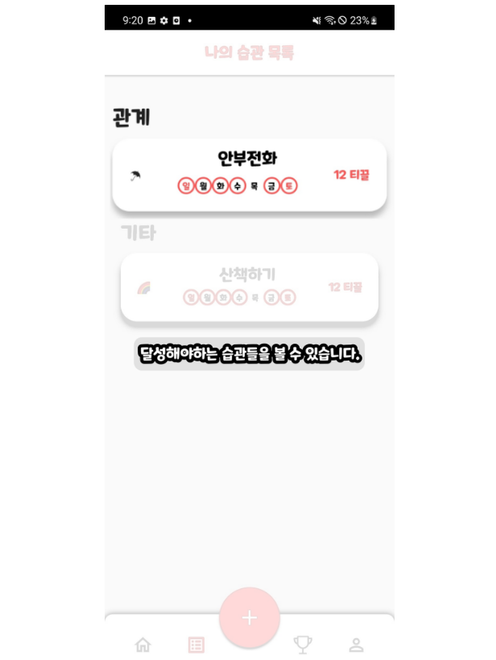

# 티끌태끌토끌 - 습관을 만들고 나를 기록할 수 있는       서포팅 어플리케이션

---

# 🖥️ 프로젝트 소개

---

### *좋은 습관을 만들고 싶다…!*

한가지 행동이 습관이 되는대는 평균 2달이 걸린다고 합니다. 저희 ‘티끌!태끌!토끌’은 습관을 등록하고 해당 습관 시간에 맞게 푸쉬 알림을 주는 어플리케이션 입니다.

시간, 일, 주별로 습관을 등록할 수 있고, 등록된 습관을 성취하면 ‘티끌’이라는 보상이 주어집니다. 또한 해당 ‘티끌’을 직관적으로 확인할 수 있어 사용자의 동기부여를 불러 일으킵니다. 추가적으로 웨어러블 장치와 연동도 가능하여 편리하게 습관을 확인하고 티끌을 쌓을 수 있습니다!

당신의 새로운 습관 형성을 돕는 '티끌!태끌!토끌' 애플리케이션은 일상에 긍정적인 변화를 가져다줄 것입니다. 이 앱은 습관 형성의 핵심인 일정한 시간과 빈도로 습관을 등록하고 추적할 수 있도록 도와줍니다.

습관을 등록하기 위해, 당신은 원하는 시간과 주기를 선택하여 앱에 습관을 입력할 수 있습니다. 예를 들어, 매일 아침 7시에 운동하기, 주말에 책을 읽기, 매주 월요일에 친구와 약속 등을 등록할 수 있습니다. 이렇게 등록된 습관은 앱이 푸시 알림을 통해 알려줌으로써 당신을 동기부여하게 해줍니다.

일정한 시간과 빈도로 푸시 알림을 받게 되면, 당신은 습관을 실천하는 데에 도움을 받을 수 있습니다. 알림을 받으면 당신은 그 시간에 해당하는 습관을 수행하도록 자극을 받을 것입니다. 이러한 반복적인 자극과 수행 사이의 조화는 새로운 습관을 형성하는 데에 중요한 역할을 합니다.

성취한 습관에 대한 보상으로 '티끌'을 얻게 됩니다. '티끌'은 습관을 등록하고 성공적으로 수행했을 때 주어지는 보상입니다. '티끌'은 앱 내에서 확인할 수 있으며, 쌓인 '티끌'의 양은 당신에게 동기부여를 해줄 것입니다.

또한, '티끌!태끌!토끌' 앱은 웨어러블 장치와도 연동하여 습관을 편리하게 확인하고 '티끌'을 쌓을 수 있게 합니다. 이를 통해 당신은 언제 어디서나 습관의 진행 상황을 파악할 수 있으며, 성취한 '티끌'을 쌓는 데에 편의성을 더할 수 있습니다.

 

# ❓ 티끌태끌토끌 - 개발 배경

---

습관이란, 우리 몸의 자동화된 일종의 행동들과 시스템입니다. 아침에 일어났을 때 이불을 개는 것, 자기 전에 독서를 하는 것, 엎드려서 자는 것, 앉았을 때 다리를 떠는 것, 좋은 습관이든 나쁜 습관이든지 간에 이 모두가 우리가 갖고 있는 다양한 습관입니다.

이렇게 우리가 의식/무의식적으로 하는 습관들은 여러가지가 있지만, 흔히 '좋은 습관'들을 갖는 것이 중요하다는 말을 들어보셨을 겁니다.

하지만 이런 '좋은 습관'을 만드는 것은 생각보다 힘듭니다.

저희는 어떻게 해야 우리가 '좋은 습관'을 만들 수 있을까 고민했습니다. 

그 결과 탄생한 티끌태끌토끌, 한번 사용해보시겠어요?

 

### 

# 🕜 티끌태끌토끌 - 개발 기간

---

- 2023. 04.10 ~ 2023. 04. 16 : 아이디어 회의 및 프로젝트 기획
- 2023. 04.17 ~ 2023. 04. 23 : 기획 구체화 및 기술 선정, ERD 설계
- 2023. 04.24 ~ 2023. 04. 30 : API 문서 작성, DB 설계, 인프라 구축
- 2023. 05.01 ~ 2023. 05. 07 : 어플리케이션, 웨어러블, 백엔드 개발
- 2023. 05.08 ~ 2023. 05. 14 : 버그 수정, 배포
- 2023. 05.15 ~ 2023. 05. 19 : 버그 수정, 발표

 

# 🧑‍🤝‍🧑 멤버 구성

---

## 프론트엔드

### 🧗🏻‍♂️ 이치헌(팀장)

- 습관 페이지 UI, 메인 페이지 UI, 프로젝트 산출물 정리

### 👨🏻 이해은(팀원)

- 티끌 페이지 UI, 회원 정보 페이지 UI, 캐릭터 디자인

 

## 백엔드

### 🎹 박한샘(팀원)

- DB 설계, 보안, FE-BE 상호연결

### 🎄 박홍빈(팀원)

- CI/CD(Docker, Jenkins), 백엔드 전체 총괄

### 💡이승진(팀원)

- DB설계, 회원, 습관, 티끌 등 API 전반

### 🈁 손정훈(팀원)

- DB설계, 보안, 로그파일 관리

 

# ⚙️ 개발 환경

---

### 프론트엔드

- IDE : Android Studio
- SDK : Flutter, Compose
- Language : Dart, Kotlin

### 백엔드

- IDE : Intellij
- SDK : Spring Boot
- Language : Java
- ORM : JPA

### 데이터베이스

- MySQL
- Redis

### 인프라

- Docker
- Jenkins
- EC2
- Firebase

### 협업툴

- GitLab
- Notion
- Jira
- Mattermost

 

# 🍓 주요 기능

## 메인화면

 
 

## 습관생성

 
 

## 습관목록

 
 

## 토끌이

 
 

## 알람설정

 
 

## 방해금지

 
 

## Wear OS 메인

 
 

## Wear OS QR Code

 
 

## Wear OS List

 
 

---

